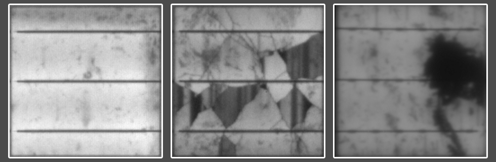

# One-vs-All-Image-Classifier

This project is a Python-based machine learning project that uses the One vs. All model for data analysis. The project 
constitutes a part of the exercise for the "Deep Learning" course offered by the 
[Friedrich-Alexander-Universität Erlangen-Nürnberg (FAU)](https://www.fau.eu/).

## Goal

This project aims to show an effective and very simple approach for achieving outstanding accuracy in binary image 
classification problems with more than one class in case of significant imbalance data between classes and/or 
significantly different features complexity between classes.

*A good read about Binary Relevance "One vs. All" you can find on [developers.google.com](https://developers.google.com/machine-learning/crash-course/multi-class-neural-networks/one-vs-all).*

## Problem

The problem is to classify if the image of a solar cell contains "cracks" and/or "inactive regions". The dataset is 
[elpv-dataset](https://github.com/zae-bayern/elpv-dataset) with modified labels. In the given problem labels contain the 
image name, crack (0 or 1), and inactive region (0 or 1). The dataset is heavily imbalanced, out of 2000 images 443 
(22.15%) images contain cracks, and 122 (6.10%) images contain inactive regions.

## Solution

This project uses two sub-models: one model for crack classification and one model for inactive region classification.
Two sub-models can be trained separately and then combined into one model. Each sub-model can be based on a different
pre-trained model and trained with different hyperparameters. Additionally, to balance the dataset positive weights are used.
Also, data augmentation by random vertical and horizontal flips is applied.

**Only by applying this simple approach the model has reached an average F1 score of *0.946* and took *1st* 
place on the Deep Learning Challenge leaderboard in WS2023/2024.**

| F1 crack  | F1 inactive | Avg F1  |
|-----------|-------------|---------|
| 0.95105   | 0.94118     | 0.94611 |

*Further improvements can be easily achieved by using more advanced techniques.*

## How to Run

1. Place the labels `data.csv` in the [`data`](./data/) folder.
2. Place the `images` folder in the [`root`](./) folder.
3. Run `pip install -r requirements.txt`
4. Specify parameters, choose the operation mood in [`main.py`](./main.py), and run it.
5. Use [`analisys.py`](./analisys.py) to analyze the model's performance.
6. Export the best combination of sub-models using the `'export'` mode in [`main.py`](./main.py).

## Note

*Dataset and labels are not part of this repository as well as trained models and best hyperparameters choice. This 
repository is not aimed to provide a ready top 1 solution but to show the approach how it can be easily achieved.*

